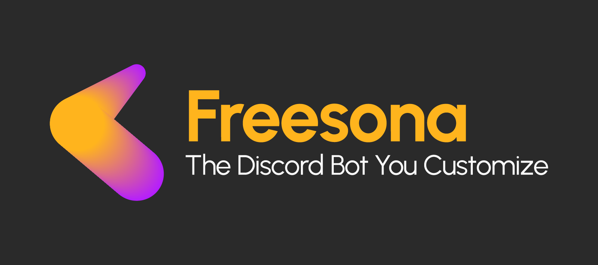

# Freesona - The Discord Bot You Customize



[Discord Support](https://discord.gg/vXPRs2cHSE)

Most AI Discord bots give you a product. Verba, MEE6, and every other hosted platform give you a personality someone else built, running on infrastructure you don't control, with a ceiling you'll eventually hit.

Freesona is different. It's a free, open alternative to hosted persona bots — with no ceiling. Fork it, drop in your API key, and get a self-hosted bot that can be a convincing AI character, a focused server utility, or both. If you want just a fraction of what paid platforms offer and want it completely free, this is for you. If you want to go further and extend it into something no hosted platform can do, you can do that too.

No credits. No voting. No "upgrade to unlock." Just a bot that does what you tell it.

## What makes it worth forking

**The persona system is built to feel alive.** `/setpersona core` and `/setpersona style` open structured modal editors — split by category — where you define personality, background, beliefs, communication style, and system instructions separately. No single text wall. Changes take effect immediately, no restart required.

**It remembers the conversation.** Freesona maintains short-term conversation context per channel using a rolling memory window. Older history is automatically summarized and injected as context so the bot stays coherent across long exchanges. Memory persists in-session and can be wiped per channel with `/clearmemory`.

**It won't double-reply.** A per-user debounce system waits before generating a response, so rapid successive messages from the same user collapse into one — no more the bot answering "can i like" and "ask something" as two separate prompts.

**It can chime in on its own.** Autonomous mode lets the bot occasionally join an active conversation unprompted, at a configurable frequency and with a per-channel cooldown. Toggle it on or off per server.

**It's also built to be extended.** The codebase uses discord.py cogs. Each feature lives in its own file. Strip out what you don't need, add what you do.

---

## Features

* **Structured Personality Editor:** `/setpersona core` and `/setpersona style` open separate modals for personality, background, beliefs, language style, and system instructions.
* **Persona Profiles:** Save, load, list, and delete named persona presets with `/personasave`, `/personaload`, `/personalist`, and `/personadelete`.
* **Persona Lock:** Prevent accidental overwrites with `/personalock` and `/personaunlock`.
* **Short-Term Conversation Memory:** Rolling per-channel context window with automatic summarization of older history. Cleared with `/clearmemory`.
* **Conversation Channel:** Designate a channel via `/setchannel` where the bot joins the conversation. Remove with `/clearchannel`.
* **Debounced Responses:** Per-user debounce prevents double-replies when messages arrive in quick succession.
* **Autonomous Mode:** Bot chimes into conversations unprompted at configurable frequency (`low` / `default` / `high`) with per-channel cooldown. Toggle via `/autonomy on|off` and `/autonomy frequency`.
* **Embed Footers:** `~ask`, `~write`, and `~search` embeds show who asked and a truncated preview of the prompt in the footer.
* **Image Input:** Attach an image to any AI command or conversation message — the bot processes it alongside the text prompt.
* **AI Write:** `~write` generates structured, formatted output using the active persona.
* **AI Ask:** `~ask` answers questions conversationally using the active persona.
* **Web Search:** `~search <query>` pulls live results and summarizes them with AI.
* **Audio Separation:** `~separate` isolates vocals and instrumental from any audio via MVSEP (BS Roformer).
* **Math Engine:** Solves equations via the Wolfram|Alpha hybrid API.
* **Media Downloader:** Downloads video or converts to MP3 directly in chat (10 MB limit).
* **Injection Detection:** Prompt injection attempts are caught and neutralized before reaching the model.
* **Persistent Prefix:** `~prefix <symbol>` changes the command prefix and saves it across restarts.
* **Hybrid Commands:** Every command works as both a prefix command and a slash command.
* **No DM AI:** AI commands are server-only by design.
* **Debug Tools:** `/debugpersona` shows the active assembled persona, last prompt, model, lock state, and autonomy status.

---

## Getting Started

### 1. Installation

```bash
git clone https://github.com/soquincy/Freesona.git
cd Freesona
pip install -r requirements.txt
```

### 2. Environment Variables

Create a `.env` file in the root directory:

```dotenv
BOT_TOKEN=YOUR_DISCORD_BOT_TOKEN
CHANNEL_ID=YOUR_LOG_CHANNEL_ID
GOOGLE_API_KEY=YOUR_GEMINI_API_KEY
GOOGLE_SEARCH_API_KEY=YOUR_GOOGLE_SEARCH_API_KEY
SEARCH_ENGINE_ID=YOUR_GOOGLE_SEARCH_ENGINE_ID
WOLFRAM_APPID_SHORT=YOUR_WOLFRAM_APPID_SHORT
WOLFRAM_APPID_LLM=YOUR_WOLFRAM_APPID_LLM
MVSEP_API_KEY=YOUR_MVSEP_API_KEY
BOT_NAME=Freesona

# Local (self-hosted)
AI_PERSONA_FILE=persona.txt
AI_PERSONAS_FILE=personas.json
CONFIG_FILE_PATH=config.json

# Cloud (Railway/Render — requires /etc/secrets volume mount)
# AI_PERSONA_FILE=/etc/secrets/persona.txt
# AI_PERSONAS_FILE=/etc/secrets/personas.json
# CONFIG_FILE_PATH=/etc/secrets/config.json
```

### 3. File Path Reference

| Environment | Path prefix | Notes |
| :--- | :--- | :--- |
| **Windows / Linux (local)** | `./` | Files saved in project folder |
| **Railway** | `/etc/secrets/` | Requires volume mounted to `/etc/secrets` |
| **Render** | `/etc/secrets/` | Create files manually in environment page |

Without a volume on cloud hosts, any changes made via commands will not survive a redeploy.

---

## Persistence & Storage

* **Prefix:** Read from `config.json` on startup. Overwritten on `~prefix` change.
* **Persona:** Assembled at runtime from structured fields stored in `persona.json`. Overwritten on editor submit.
* **Persona Profiles:** Stored as `personas.json`. Survives restarts if path is persistent.
* **Conversation Memory:** In-memory only (ephemeral). Cleared on restart or via `/clearmemory`.
* **Conversation Channel:** Stored in `config.json` as `chat_channel_id`. Set via `/setchannel`.
* **Autonomy Settings:** Stored in `config.json` (`autonomy`, `autonomy_frequency`). Persist across restarts.

---

## Command Reference

### AI Commands

| Command | Action | Notes |
| :--- | :--- | :--- |
| `~write <prompt>` | Generate structured written output | Stateless; embed footer shows requester + prompt |
| `~ask <question>` | Ask a conversational question | Stateless; embed footer shows requester + prompt |
| `~search <query>` | Web search with AI summary | Requires Google Search API; embed footer shows requester + query |
| `~separate <url>` | Separate vocals and instrumental | Requires MVSEP API key |

### Conversation Channel

| Command | Action | Permissions |
| :--- | :--- | :--- |
| `/setchannel #channel` | Set the AI conversation channel | Administrator |
| `/clearchannel` | Remove the conversation channel | Administrator |
| `/clearmemory` | Wipe channel memory and summary | Administrator |

The bot responds to all messages in the conversation channel, with debouncing to prevent double-replies on rapid input. It keeps the last 5 messages as context and summarizes older history automatically.

### Persona Management

| Command | Action | Permissions |
| :--- | :--- | :--- |
| `/setpersona core` | Edit core personality and background | Bot Owner |
| `/setpersona style` | Edit beliefs, language style, and system instructions | Bot Owner |
| `/personalock` | Lock persona against changes | Bot Owner |
| `/personaunlock` | Unlock persona | Bot Owner |
| `/personasave <name>` | Save current persona as a preset | Bot Owner |
| `/personaload <name>` | Load a saved persona preset | Bot Owner |
| `/personalist` | List all saved presets | Bot Owner |
| `/personadelete <name>` | Delete a saved preset | Bot Owner |
| `/debugpersona` | Show active persona, last prompt, model, lock state, autonomy status | Bot Owner |

### Autonomy

| Command | Action | Permissions |
| :--- | :--- | :--- |
| `/autonomy on` | Enable autonomous mode | Administrator |
| `/autonomy off` | Disable autonomous mode | Administrator |
| `/autonomy frequency <low/default/high>` | Set how often the bot speaks unprompted | Administrator |

Autonomous mode fires at a random chance per message (`low` = 4%, `default` = 10%, `high` = 20%) with a 120-second cooldown per channel. Settings persist in `config.json`.

### Moderation & Utility

| Command | Action | Permissions |
| :--- | :--- | :--- |
| `~prefix <symbol>` | Change command prefix | Administrator |
| `~purge <limit>` | Delete messages | Manage Messages |
| `~math <equation>` | Solve an equation | Anyone |
| `~download <url>` | Download video | Anyone |
| `~audio <url>` | Download audio (MP3) | Anyone |

---

## Acknowledgements

* [discord.py](https://discordpy.readthedocs.io/)
* [Google Gemini](https://ai.google.dev/)
* [Wolfram|Alpha](https://developer.wolframalpha.com/)
* [yt-dlp](https://github.com/yt-dlp/yt-dlp)
* [MVSEP](https://mvsep.com/)

---

## License

Licensed under the **MIT License**. See the [LICENSE](LICENSE) file for details.

---

## Roadmap

### Short-term

* **Codebase modularization** — `cogs/genai.py` has grown past 1,000 lines. Planned split into focused utility modules under `utils/`:
  * `utils/generation.py` — `generate`, `safe_generate`, `build_response`, `ConversationResponse`, all error classes
  * `utils/persona.py` — persona data layer, modals, `SetPersonaGroup`
  * `utils/memory.py` — channel memory, summarization, `push_memory`
  * `utils/security.py` — injection detection, rate limiter, output sanitization
  * `utils/config.py` — `load_config`, `save_config`, embed footer helper
  * `utils/search.py` — `web_search`
  * `cogs/genai.py` retains only `GenAICog` wiring (~300 lines)

### Medium-term

* **True long-term memory** — per-user, per-guild memory persisted to disk with auto-extraction and importance scoring (currently memory is in-session only)
* **Split messaging** — multi-message responses with configurable per-segment delay and typing indicator (currently all segments are combined into one message before sending)
* Username memory persistence across restarts
* Multi-model support — swap providers via env variable without touching code
* Conversation channel mention/reply filtering — option to restrict bot responses to mentions and replies only
* Persona gallery in the wiki — ready-made prompts showing what Freesona can do

### Long-term

* Knowledge base — persistent entries injected into system prompt context, managed via slash commands (`/kbadd`, `/kblist`, `/kbdelete`)
* Per-user memory commands — `/memorylist <user>`, `/memoryclear <user>` for bot owners
* Web dashboard via FastAPI for persona editing — `fastapi_server.py` is already in the repo as a foundation
